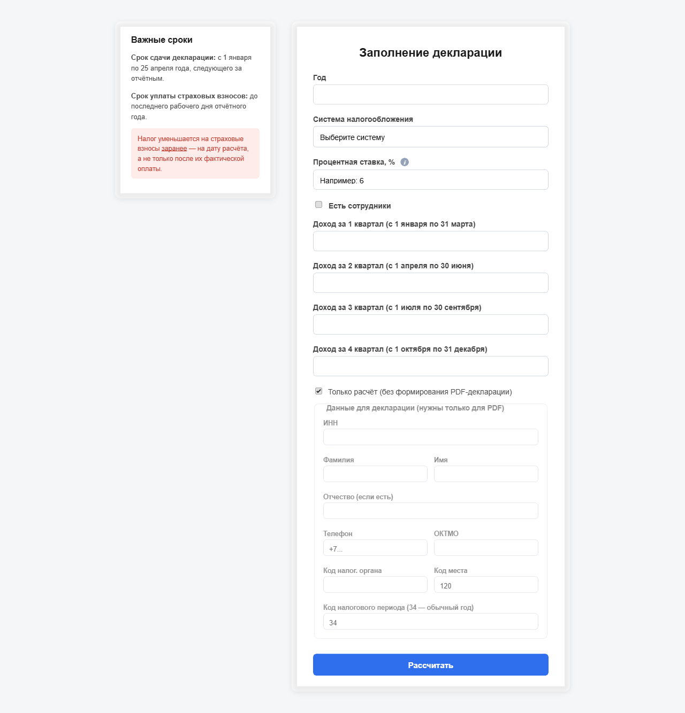

# Калькулятор налога УСН (Доходы) + генератор декларации

Веб-сайт на Flask для расчёта налога по УСН «Доходы» с учётом страховых взносов
и генерации заполненной декларации в формате PDF.

⚠️ **Важно:** сайт носит справочный характер и не заменяет консультацию
с бухгалтером или ФНС. Актуальность конкретных сумм (страховые взносы,
пороги, лимиты) нужно сверять с текущим законодательством перед реальным
использованием — они меняются каждый год.




## Возможности

- Расчёт налога УСН «Доходы» нарастающим итогом по кварталам
- Учёт фиксированных страховых взносов и допвзноса 1% с дохода свыше 300 000 ₽
- Учёт лимита уменьшения налога (50% — с сотрудниками, 100% — без сотрудников)
- Предупреждение о пороге НДС (20 000 000 ₽ в год)
- Генерация заполненной декларации УСН в PDF (Титульный лист + Разд. 1.1 + Разд. 2.1.1)

## Ограничения

- Поддерживается только режим **УСН «Доходы»** (не «Доходы минус расходы»)
- Не учитывается повышенная ставка 8% при превышении лимитов по доходу/сотрудникам
- Расчёт НДС не реализован — при превышении 20 млн ₽ сайт только предупреждает
- Генерируемый PDF не содержит служебных 2D-штрихкодов, которые добавляют
  системы ФНС при электронной подаче — подходит для печати/переноса данных,
  но не для прямой загрузки как есть в личный кабинет ФНС
- Суммы страховых взносов по годам захардкожены в `tax_calculator.py` —
  при наступлении нового года их нужно обновить вручную

## Требования

- **Python 3.11–3.13** (стабильная версия — альфа/бета-версии, например 3.15a2,
  могут вызывать конфликты с библиотекой Pillow)
- pip

## Быстрый запуск без установки Python

Если не хочешь разбираться с Python и терминалом — скачай готовый
исполняемый файл со страницы [Releases](https://github.com/RIDIKT/Declaration_IP/releases/tag/v1.0) и просто
запусти `UsnDeclaration.exe` двойным кликом. Откроется окно консоли
(не закрывай его) и браузер с сайтом.

## Установка и запуск

```bash
git clone https://github.com/RIDIKT/Declaration_IP.git
cd Declaration_IP

python -m venv venv

# Windows:
venv\Scripts\activate
# macOS/Linux:
source venv/bin/activate

pip install -r requirements.txt

python app.py
```

Сайт будет доступен по адресу `http://127.0.0.1:5000`.

## Тесты

```bash
pip install -r requirements-dev.txt
pytest
```

## Структура проекта

```
Declaration_IP/
├── app.py                  # маршруты Flask, обработка формы, валидация
├── tax_calculator.py       # логика расчёта налога
├── pdf_generator.py        # генерация PDF-декларации
├── pdf_template/           # фоновые изображения бланка декларации + координаты полей
│   ├── tile_data.json
│   └── tiles/
├── templates/
│   ├── index.html          # страница ввода данных
│   └── result.html         # страница результата
├── static/                 # favicon и другие статичные файлы
├── tests/                  # тесты (pytest)
├── requirements.txt
└── requirements-dev.txt    # requirements.txt + pytest
```

## Как это работает (коротко)

1. Пользователь вводит доходы по кварталам, ставку, год — на главной странице
2. `tax_calculator.calculate_tax_by_quarters()` считает налог нарастающим итогом,
   с округлением до целых рублей по правилам ФНС
3. Результат выводится в виде таблицы и итоговой суммы
4. Если указаны личные данные (ИНН, ФИО, ОКТМО и т.д.) — можно скачать
   заполненный PDF декларации, собранный наложением текста на отсканированный
   бланк (координаты откалиброваны вручную по реальному примеру декларации)

## Лицензия / статус проекта

Учебный/личный проект. Используется на свой страх и риск, без гарантий
корректности для реальной подачи налоговой отчётности.

Код распространяется под лицензией [MIT](LICENSE).
